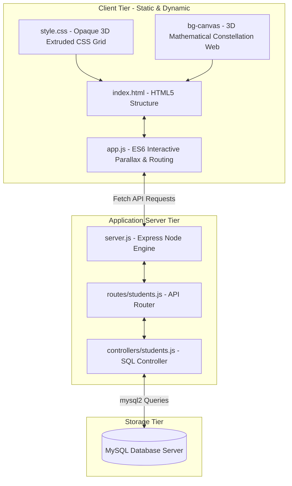
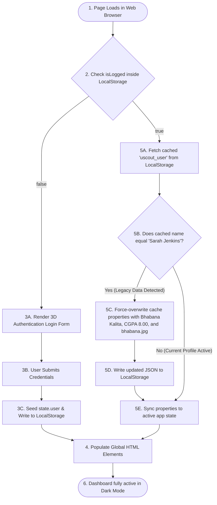
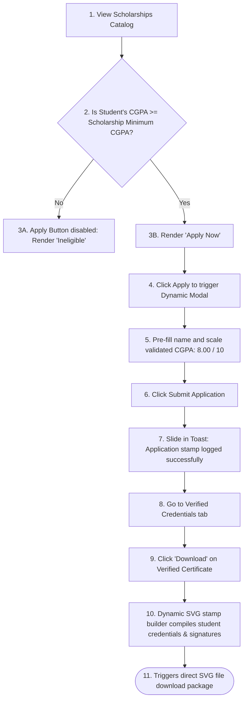

#  UniScout - Unified Smart Campus Portal

UniScout is a state-of-the-art, high-fidelity campus resource portal and ERP dashboard designed to unify academic management, event calendars, student clubs, notices, and faculty directories into a singular web ecosystem. 

Featuring a premium **3D Cyber-Obsidian & Electric Purple theme** with mathematical parallax effects, custom mathematical cursor tracking, and active standby backend fallback synchronization, UniScout provides a highly premium and intuitive experience for students.

---

##  System Architecture

UniScout utilizes a decoupled, high-performance web architecture that balances direct API integrations with resilient frontend fallback mechanics.



### Architectural Highlights
1. **Opaque 3D Slabs (No Glassmorphism)**: Elements feature solid obsidian card slabs (`0% blur`), sharp high-contrast neon borders, and hard solid shadow layers for a physical depth-extruded layout.
2. **3D Constellation Vector Engine**: Features a coordinate-skewed particle grid projected in real-time onto a `<canvas>` element using true mathematical 3D-to-2D projection formulas mapping depth (`z-axis`) drift.
3. **Standby Fail-safe System**: If the connection between the client and Express API is disrupted or if the MySQL relational database is offline, the client-side engine automatically switches to a high-fidelity local pre-seeded database, guaranteeing zero operational downtime.

---

##  Core System Flowcharts

### 1. Cached Session Storage Verification & Migration Check
This chart maps the startup process where any cached session containing outdated student parameters (e.g., "Sarah Jenkins") is automatically identified, corrected, and updated inside the browser's persistent cache.



### 2. Scholarship Application & verified certificate stamps Flow
This workflow demonstrates how academic achievements are validated and issued using SVG vector generators on the fly.



---

## 🔌 API Documentation

All back-end operations are hosted on **Port 5000**. The static file server hosts static web assets directly, whereas API routes communicate via raw JSON.

### 1. Students Database API
Allows fetching of active registered campus records. If the connection fails, the frontend automatically invokes offline mock catalog overrides.

* **Endpoint**: `GET /api/students`
* **Content-Type**: `application/json`
* **Success Response**: `200 OK`
* **Sample Payload**:
```json
[
  {
    "student_id": "US-2026-981",
    "name": "Bhabana Kalita",
    "email": "b.kalita@university.edu",
    "major": "Computer Science",
    "gpa": "8.00"
  },
  {
    "student_id": "US-2026-982",
    "name": "John Doe",
    "email": "j.doe@university.edu",
    "major": "Electrical Engineering",
    "gpa": "3.42"
  }
]
```

### 2. Dynamic Status Checks
UniScout renders a database standby banner inside the **Students Registry** tab. The frontend conducts ping updates to check connection status.
* **Success (Banner turns Green)**: DB connection established.
* **Standby / Offline (Banner turns Amber)**: Express server is offline or MySQL is not running. System falls back gracefully to high-fidelity mocks.

---

## 🛠️ Step-by-Step Installation & Run Guide

### Prerequisites
* **Node.js** (v18 or higher recommended)
* **npm** (Node Package Manager)

### Step 1: Clone and Navigate
```bash
cd c:\Users\Bhabana Kalita\Downloads\UniScout_portal-main\UniScout_portal-main
```

### Step 2: Install Core Dependencies
Install dependencies for both the main Express server and the frontend directory:
```bash
npm install
```

### Step 3: Run the Application
Start the node development server. It will immediately mount the Express backend and serve your static frontend:
```bash
npm start
```
*Output in terminal should read:* `Server running on port 5000`

### Step 4: Open in Browser
Open your browser and navigate to:
 **[http://localhost:5000/](http://localhost:5000/)**

---

##  Key Areas for Future Improvement

While the platform is highly optimized and interactive, implementing the following additions will elevate it to a production-grade enterprise platform:

### 1. Persistent Cloud Authentication Integration
* **Current State**: The portal uses a simplified mock credentials check with local browser caching.
* **Proposed Upgrade**: Integrate **JSON Web Tokens (JWT)** or a service like **Firebase/Supabase** to securely encrypt sessions, support multi-factor auth, and link users directly to standard cloud databases instead of `localStorage`.

### 2. High-Performance WebSockets Noticeboard
* **Current State**: Notifications and noticeboard circulars are updated on full-page client-side reloads or actions.
* **Proposed Upgrade**: Implement a real-time **Socket.io** connection layer to deliver instant, campus-wide emergency banners and notifications to active browser tabs without requiring manual reloads.

### 3. ES6 JavaScript Modularization
* **Current State**: `app.js` handles data catalogs, routing, UI rendering, 3D particles, and page triggers in a singular comprehensive script (1600+ lines).
* **Proposed Upgrade**: Segment `app.js` into structured ES6 components (e.g., `themeEngine.js`, `constellationBg.js`, `sessionManager.js`, `apiRouter.js`) and bundle them using **Vite** or **Webpack** to improve codebase maintainability.

### 4. React Sub-Project Integration
* **Current State**: The React-based sub-project `scout-campus-verse` is currently an independent prototype layout.
* **Proposed Upgrade**: Migrate the premium vanilla styling system and customized backend API connections directly into the React + TypeScript app to replace the static HTML structure with a fully reactive component architecture.
